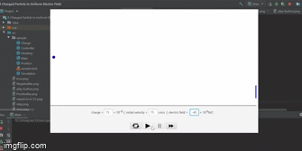
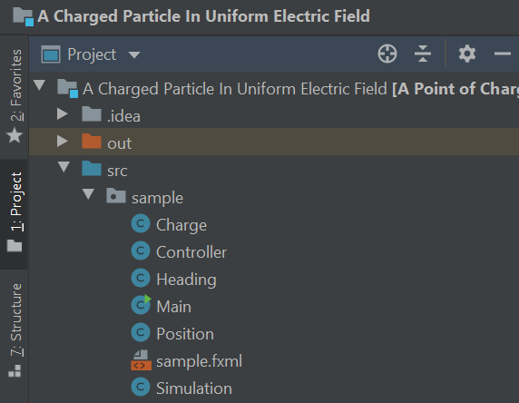
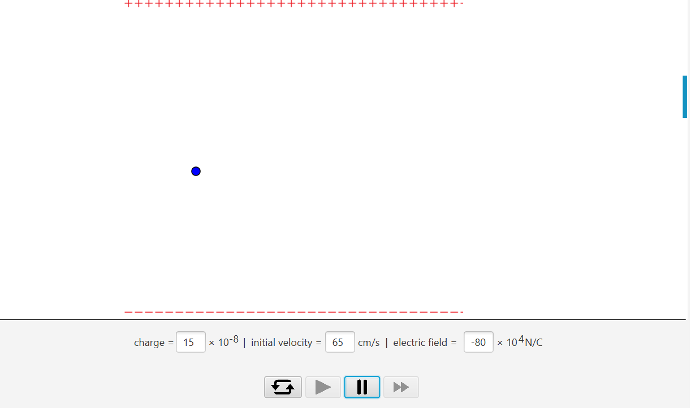

# Charged-Particle-in-Constant-Electric-Field
## Description



a Javafx simulation of the movement of a charged particle in constant electric field.


This project is written in **Java** using **javafx** and obeys OOP principles. The main scene of the project is made by Scenebuilder and a controller which is where the simulation concept is. And some classes to create a charge particle with its attributes.




The `Charge` class is for initiallizing our charged particle and has some data fields like *position* ,*heading* ,... .The `Position` class describes where the charge is and the `Heading` class contains two double variables *dx* and *dy* which shows the velocity of the charged particle.
For the charge entered the electric field , the motion concept is that *dx* is constant and *dy* should be 0 initially. As the charge enters the field *dy* should be increased by a constant value which we name it gravity and in order to create a curved movement this addition should happen in every single dt untill the charge leaves the electric filed. gravity value is calculated with the values of charge and electric field TextFields and the *dx* is calculated with value of initial velocity TextField. there are 4 buttons for playing , pausing , step and restarting the simulation. there is also produced a target which is a rectangle and has random position and color which makes it similarler to a game and user should fill the TextFields in order to charge hits the target.

Here is lines of code for the charge motion : 

```java
if(isInField(sim.charge.getPosition().getX()))
   sim.charge.setHeading(new Heading(sim.charge.getHeading().getDx() , sim.charge.getHeading().getDy() + gravity));
```



